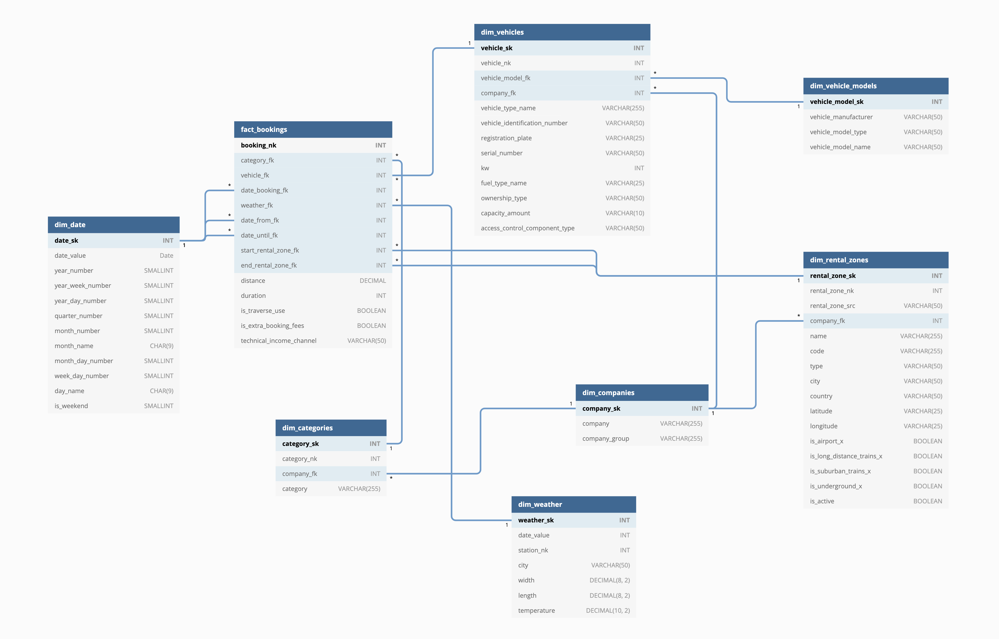

# Udacity Data Engineering Capstone Project
## Project Description

The goal of this project is to pull data from at least 2 different sources and to prepare an analytical data model.
1. Data related to Carsharing Bookings and Cars from Deutsche Bahn: https://data.deutschebahn.com/dataset/data-flinkster 
2. Weather Data from german weather stations gathered from DWD: 
https://opendata.dwd.de/climate_environment/CDC/derived_germany/soil/daily/historical/

The following questions should be answered:
* Which cities are the most successful ones related to the usage of Car Sharing?
* How long is the average, longest and shortest distance for a Car sharing trip?
* Is there a relation between the number of car sharing usages and temperatures?

### Data assessment
* The Car Sharing data is available for bookings between June 2013 and May 2017
* Weather data is available for 487 weather stations between January 1991 and December 2019 
* As there isn't a weather station available in each city, temperatures can't be matched to all car bookings
* Boolean values are given as german 'Ja/Nein' in the booking data, this will be translated to Boolean 1 & 0
* latitude and longitude values are given with ',' ac decimal separator and therefor can't be read in as Decimal in the first place
* some columns appear occasional empty, default values are applied

### Target Data model



The above ER-Diagram shows the target Data Model that has been designed in order to answer the given questions above.
It contains of 1 Fact and 7 Dimension Tables. The Fact Table (`fact_bookings) contains metrics about the duration and the distance of a booked car sharing trip.

Details on the different tables can be found in the  [Data Dictionary](resources/DataDictionary.md).


### ETL pipeline
There are two pipelines available, one taking care of initializing the Database and one for populating the data. 

#### Initialization


The initialization Flow is split up into SubDAGs for Stage, Dimensions & Facts.

##### init_stage_sub_dag
 

The `init_stage_sub_dag` is in charge of creating the tables necessary to store the Data in the Redshift Database. 
Each Table is getting dropped if it exists before creating a new version.

##### init_dims_sub_dag


The `init_dims_sub_dag` is in charge of creating the Schema for the necessary Dimension Tables. As well as for the staging tables,
the tables are dropped (if they exist already) in order to create a fresh copy with the latest changes on the schema.

##### init_facts_sub_dag


The `init_facts_sub_dag` is in charge of creating the tables necessary to store the Data in the Redshift Database. 
Each Table is getting dropped if it exists before creating a new version.

#### Data Load


The Data Load DAG is split into three different SubDAGs as well.

##### load_stage_sub_dag
 

The `load_stage_sub_dag` is taking care of loading the data from S3 to Redshift using `COPY` Statements. After loading the data, 
defined data quality checks are executed. If successful, the Pipeline continues.

##### load_dimensions_sub_dag


Within `load_dimensions_dag` the Dimensions are created out of the staging tables using SQL. 

##### load_facts_sub_dag


Last but not least, `load_facts_sub_dag` loads data into the fact table using SQL.

### Analytical Queries

* Number of Bookings per City and Year
```sql
SELECT
 d.year_number,
 drz.city,
 COUNT(distinct b.booking_nk)
FROM fact_bookings b
JOIN dim_rental_zones drz ON b.start_rental_zone_fk = drz.rental_zone_sk
JOIN dim_date d ON b.date_booking_fk = d.date_sk
GROUP BY d.year_number, drz.city
```

* Average, shortest and longest distance per City
```sql
SELECT
 drz.city,
 AVG(b.distance),
 MIN(b.distance),
 MAX(b.distance)
FROM fact_bookings b
JOIN dim_rental_zones drz ON b.start_rental_zone_fk = drz.rental_zone_sk
GROUP BY drz.city
```

* Average Distance per Temperature Cluster
```sql
SELECT
 CASE WHEN w.temperature < -5 THEN '< -5'
      WHEN w.temperature >= 5 AND w.temperature < 0 THEN '-5 to 0'
      WHEN w.temperature >= 0 AND w.temperature < 5 THEN '0 to 5'
      WHEN w.temperature >= 5 AND w.temperature < 10 THEN '5 to 10'
      WHEN w.temperature >= 10 AND w.temperature < 15 THEN '10 to 15'
      WHEN w.temperature >= 15 AND w.temperature < 20 THEN '15 to 20'
      WHEN w.temperature >= 20 AND w.temperature < 25 THEN '20 to 25'
      WHEN w.temperature >= 25 THEN '> 25'
 END,
 AVG(b.distance)
FROM fact_bookings b
JOIN dim_weather w ON b.weather_fk = w.weather_sk
group by 1
```


### Choice of technologies
For this project, Airflow was chosen because it allows us to build complex pipelines in a modular manner. 
Different stages can be separated into tasks with specified dependencies between them. With setting up the dependencies, 
we can easily manage which tasks can run in parallel and which need to run in sequential order.
The Airflow UI enables us to analyse the individual runs of a pipeline and one can easily check on failures and observe 
logfiles.

Amazon Redshift has been chosen as a Cloud Data Warehouse because of its scalability as well as its ease of use. 
Having a higher amount of data to process, one can easily increase the amount of processing nodes as well as their size. 
Since there is built-in support to load data from S3, it has been chosen to store the raw data.  

## next steps
* With the current setup only a Batch Operation on the few files is supported. It would be much better and more scalable
to integrate the data by retrieving it from APIs periodically. With using the Airflow schedules we could also only load 
the data for the time-range given by the schedule.
In Addition to that, the Redshift Schema has to be tweaked using another distribution style in order to reduce data shuffling.

* In order to prepare the Pipeline to be ready by 7am each day, I'd use the Pipeline Scheduler function. Based on the 
average duration on past runs, I'd chose an appropriate schedule time. In addition to that, I'd use the Airflow SLA
Feature to get notified on failures and long running runs. 

* Technology-wise, there is no problem having 100+ users accessing the database, as we can scale the number of cluster 
nodes and their size. Nevertheless, it is helpful to analyse the Requirements of the users to be able to adapt the Scheme accordingly
and to provide additional views on the data if necessary. This will help to increase the acceptance of the solution. 

## Setup 
### Running the project


